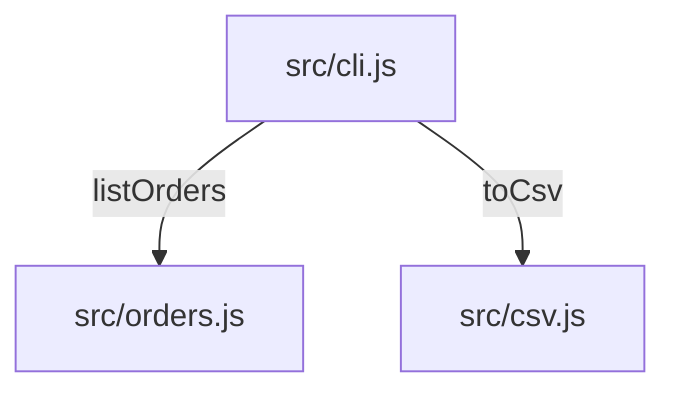

# Design: csv-export

## Overview
A pure serializer (`src/csv.js`) turns the order list into CSV text; the CLI (`src/cli.js`) prints it when `--csv` is passed. The default listing is unchanged.

## Architecture


## Reuse & Integration
| Kind | What | Where (path) | Why / notes |
|---|---|---|---|
| Reuse | `listOrders()` — the order store | `src/orders.js` | the default listing already reads the orders through it; the export reads the same list |
| Extend | the CLI's argument handling | `src/cli.js` | a `--csv` branch beside the default listing, which stays unchanged |
| New | `toCsv()` — the serializer | `src/csv.js` | no CSV or quoting helper exists in the app (searched `csv`, `serialize`, `quote`, `escape` in src/); Node core only |

**Module boundaries:** `src/csv.js` is a pure function (orders in, text out) and imports nothing; `src/cli.js` wires it to the store.

## Alternatives & Trade-offs
| Decision | Option | Pros | Cons | Cost if wrong | Chosen |
|---|---|---|---|---|---|
| CSV writer | A CSV library | Handles every quoting rule | A runtime dependency (the constitution forbids it) | A dependency to audit and update | ✗ |
| CSV writer | A small serializer in `src/csv.js` | Node core only; four rules to test | Quoting rules are ours to get right | A broken column on an odd customer name — caught by the quoting tests | ✓ |

## Data Models
```typescript
interface Order {
  id: string;       // o-1001
  date: string;     // ISO date
  customer: string; // free text, may contain commas or quotes
  total: number;    // euros
}
```

## API Contracts
### CLI `node src/cli.js --csv`
- **Output:** CSV text on stdout, header `id,date,customer,total`, exit code 0.

## Security Considerations
Local tool, no network and no user input beyond the flag. Quoting prevents a customer name from shifting columns.

## Error Handling
An empty store prints only the header (EC-1). There are no other failure modes.

## Testing Strategy
- Unit: `test/csv.test.js` covers the header, quoting and the empty list; `test/cli.test.js` covers the flag.

## Risks
| Risk | Likelihood | Impact | Mitigation | Owner |
|---|---|---|---|---|
| A spreadsheet reads a customer name starting with `=` as a formula | low | medium | Out of scope for this flag; noted for a follow-up | maintainer |

## Constitution Check
- [x] No runtime dependencies — complies, Node core only.
- [x] Every behaviour change ships with a test naming its T-ID — complies, T-01 to T-04.
- [x] Output formats are stable — complies, a new flag and new output only.

## Complexity Tracking
None.
