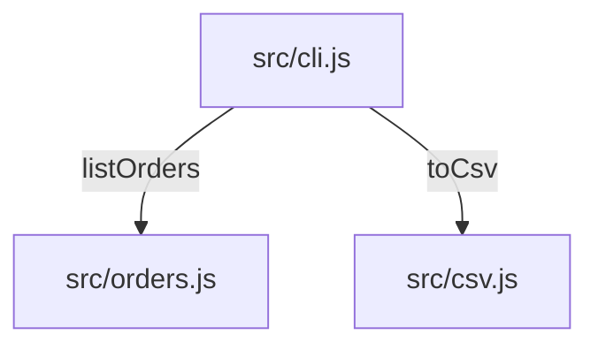

# Design: csv-export

## Overview
A pure serializer (`src/csv.js`) turns the order list into CSV text; the CLI (`src/cli.js`) prints it when `--csv` is passed. The default listing is unchanged.

## Architecture


## Data Models
```typescript
interface Order {
  id: string;       // o-1001
  date: string;     // ISO date
  customer: string; // free text, may contain commas or quotes
  total: number;    // euros
}
```

## API Contracts
### CLI `node src/cli.js --csv`
- **Output:** CSV text on stdout, header `id,date,customer,total`, exit code 0.

## Security Considerations
Local tool, no network and no user input beyond the flag. Quoting prevents a customer name from shifting columns.

## Error Handling
An empty store prints only the header (EC-1). There are no other failure modes.

## Testing Strategy
- Unit: `test/csv.test.js` covers the header, quoting and the empty list; `test/cli.test.js` covers the flag.

## Constitution Check
- [x] No runtime dependencies — complies, Node core only.
- [x] Every behaviour change ships with a test naming its T-ID — complies, T-01 to T-04.
- [x] Output formats are stable — complies, a new flag and new output only.

## Complexity Tracking
None.
