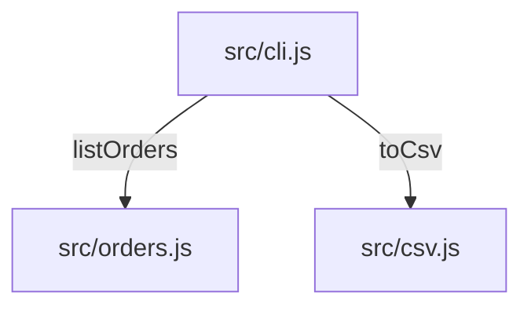

# Diseño: exportar-csv

## Visión General
Un serializador puro (`src/csv.js`) convierte la lista de pedidos en texto CSV; la CLI (`src/cli.js`) lo imprime cuando recibe `--csv`. El listado por defecto no cambia.

## Arquitectura


## Reutilización e Integración
| Tipo | Qué | Dónde (ruta) | Por qué / notas |
|---|---|---|---|
| Reutilizar | `listOrders()` — el almacén de pedidos | `src/orders.js` | el listado por defecto ya lee los pedidos con él; la exportación lee la misma lista |
| Extender | el manejo de argumentos de la CLI | `src/cli.js` | una rama `--csv` junto al listado por defecto, que no cambia |
| Nuevo | `toCsv()` — el serializador | `src/csv.js` | la aplicación no tiene ningún helper de CSV ni de entrecomillado (buscado `csv`, `serialize`, `quote`, `escape` en src/); solo el núcleo de Node |

**Límites de módulos:** `src/csv.js` es una función pura (pedidos de entrada, texto de salida) y no importa nada; `src/cli.js` la conecta al almacén.

## Alternativas y Compensaciones
| Decisión | Opción | Pros | Contras | Coste si falla | Elegida |
|---|---|---|---|---|---|
| Escritor CSV | Una librería CSV | Cubre todas las reglas de entrecomillado | Una dependencia de runtime (la constitución lo prohíbe) | Una dependencia que auditar y actualizar | ✗ |
| Escritor CSV | Un serializador pequeño en `src/csv.js` | Solo el núcleo de Node; cuatro reglas que probar | Las reglas de entrecomillado son nuestras | Una columna rota con un nombre raro — lo detectan los tests de entrecomillado | ✓ |

## Modelos de Datos
```typescript
interface Order {
  id: string;       // o-1001
  date: string;     // fecha ISO
  customer: string; // texto libre, puede tener comas o comillas
  total: number;    // euros
}
```

## Contratos de API
### CLI `node src/cli.js --csv`
- **Salida:** texto CSV en stdout, cabecera `id,date,customer,total`, código de salida 0.

## Consideraciones de Seguridad
Herramienta local, sin red y sin más entrada que el flag. El entrecomillado impide que un nombre desplace columnas.

## Manejo de Errores
Sin pedidos se imprime solo la cabecera (EC-1). No hay otros modos de fallo.

## Estrategia de Testing
- Unitarios: `test/csv.test.js` cubre la cabecera, el entrecomillado y la lista vacía; `test/cli.test.js` cubre el flag.

## Riesgos
| Riesgo | Probabilidad | Impacto | Mitigación | Responsable |
|---|---|---|---|---|
| Una hoja de cálculo lee como fórmula un nombre de cliente que empieza por `=` | baja | media | Fuera del alcance de este flag; anotado para después | mantenedor |

## Verificación de la Constitución
- [x] Sin dependencias de runtime — cumple, solo el núcleo de Node.
- [x] Todo cambio llega con un test que nombra su T-ID — cumple, T-01 a T-04.
- [x] Los formatos de salida son estables — cumple, flag nuevo y salida nueva.

## Seguimiento de Complejidad
Ninguna.
