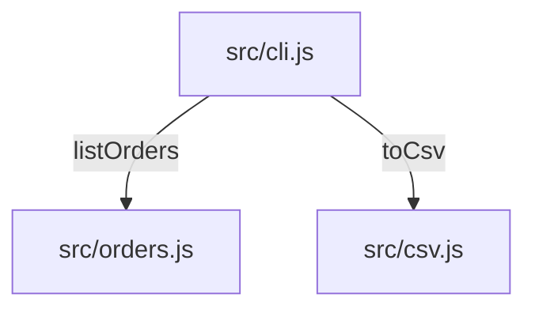

# Diseño: exportar-csv

## Visión General
Un serializador puro (`src/csv.js`) convierte la lista de pedidos en texto CSV; la CLI (`src/cli.js`) lo imprime cuando recibe `--csv`. El listado por defecto no cambia.

## Arquitectura


## Modelos de Datos
```typescript
interface Order {
  id: string;       // o-1001
  date: string;     // fecha ISO
  customer: string; // texto libre, puede tener comas o comillas
  total: number;    // euros
}
```

## Contratos de API
### CLI `node src/cli.js --csv`
- **Salida:** texto CSV en stdout, cabecera `id,date,customer,total`, código de salida 0.

## Consideraciones de Seguridad
Herramienta local, sin red y sin más entrada que el flag. El entrecomillado impide que un nombre desplace columnas.

## Manejo de Errores
Sin pedidos se imprime solo la cabecera (EC-1). No hay otros modos de fallo.

## Estrategia de Testing
- Unitarios: `test/csv.test.js` cubre la cabecera, el entrecomillado y la lista vacía; `test/cli.test.js` cubre el flag.

## Verificación de la Constitución
- [x] Sin dependencias de runtime — cumple, solo el núcleo de Node.
- [x] Todo cambio llega con un test que nombra su T-ID — cumple, T-01 a T-04.
- [x] Los formatos de salida son estables — cumple, flag nuevo y salida nueva.

## Seguimiento de Complejidad
Ninguna.
