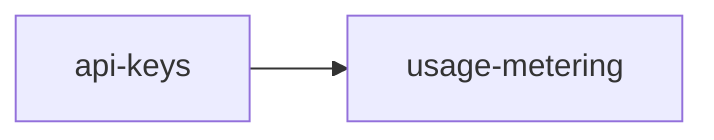

# Roadmap — demo-project

<!-- AUTO-GENERATED by dev-spec — do not edit by hand. -->

**Progress: 70%** ▰▰▰▰▰▰▰▱▱▱ · 0/2 features complete · 0/16 tasks done

Legend: ✅ done · 🟡 in progress · ⛔ blocked · ⬜ not started

## ▶ Next up
- **api-keys** (core +tdd +saas) — next #1 Add `api_keys` table migration + indexes (

## Features

| | Feature | Tracks | Phase | % | Tasks | Deps | Next |
|---|---|---|---|---|---|---|---|
| ⬜ | [api-keys](./api-keys/requirements.md) | core +tdd +saas | tasks-ready | 70% | 0/8 | — | #1 Add `api_keys` table migration + indexes ( |
| ⛔ | [usage-metering](./usage-metering/requirements.md) | core +saas | tasks-ready | 70% | 0/8 | api-keys ✗ | blocked |

## Dependencies

## ⚠ Needs attention

- **usage-metering** — blocked by api-keys
- **usage-metering** — design has unfilled (TODO) sections

## Backlog (planned, not yet specced)

- [ ] **two-factor-auth** — TOTP via authenticator
