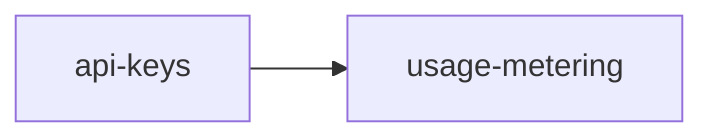

# Roadmap — demo-project

<!-- AUTO-GENERATED by dev-spec — do not edit by hand. -->

**Progress: 19%** ▰▰▱▱▱▱▱▱▱▱ · 0/2 features complete · 0/17 tasks done

_Velocity: not enough data yet — 0 of the 3 completed tasks a forecast needs in the last 28 days_

Legend: ✅ done · 🟡 in progress · ⛔ blocked · 📋 planned · ⬜ not started

## ▶ Next up
- **api-keys** (core +tdd +saas) — next #1 Confirm the Phase 4 tests T-01, T-02, T-03

## Features

| | Feature | Tracks | Phase | % | Tasks | Deps | Next | ETA |
|---|---|---|---|---|---|---|---|---|
| 📋 | [api-keys](./api-keys/requirements.md) | core +tdd +saas | tasks-ready | 30% | 0/9 | — | #1 Confirm the Phase 4 tests T-01, T-02, T-03 | — |
| ⛔ | [usage-metering](./usage-metering/requirements.md) | core +saas | requirements | 8% | 0/8 | api-keys ✗ | blocked | — |

## Dependencies

```mermaid
graph LR
  f_api_keys["api-keys"] --> f_usage_metering["usage-metering"]
```

## ⚠ Needs attention

- **usage-metering** — blocked by api-keys
- **usage-metering** — mandatory sections missing/unfilled: [SaaS] Performance Budget (unfilled), [SaaS] Scale Design (unfilled), [SaaS] Multi-tenancy (unfilled), [SaaS] Observability (unfilled), [SaaS] Cost Envelope (unfilled)
- **usage-metering** — template placeholders in the current phase: requirements.md

## Backlog (planned, not yet specced)

- [ ] **two-factor-auth** — TOTP via authenticator
