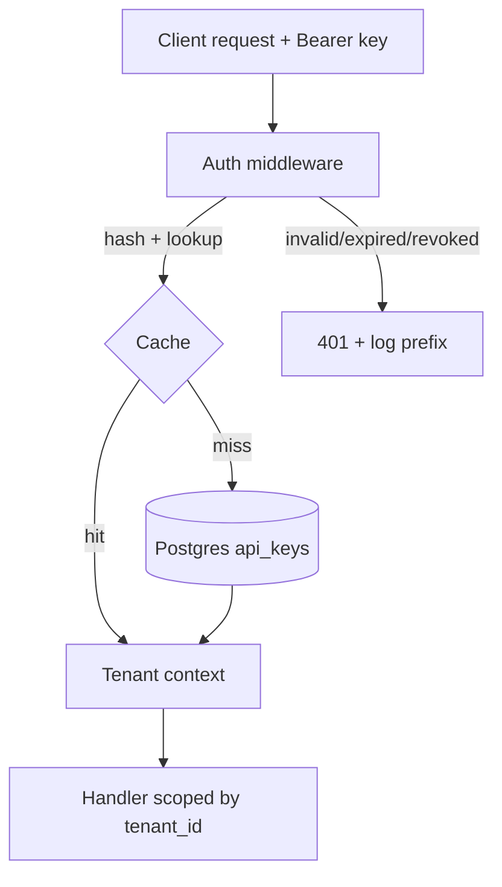

# Design: API Keys

## Overview
A stateless verifier in front of the API. Keys are random 32-byte tokens shown once; we store a
SHA-256 hash + a 8-char prefix + tenant_id + status + expiry. Verification hashes the presented key
and looks it up, with a short in-memory + Redis cache to hit the 50ms P95.

## Architecture


## Data Models
```typescript
interface ApiKey {
  id: string;
  tenant_id: string;      // every read is scoped by this
  hash: string;           // sha-256 of the token (never the token itself)
  prefix: string;         // first 8 chars, safe to log
  status: 'active' | 'revoked';
  expires_at: string | null;
  rotated_from: string | null;  // links a rotated key to its predecessor
}
```

## API Contracts
### POST /v1/keys
- **Request:** `{ name: string }`
- **Response (201):** `{ id, prefix, token }`  // token shown once
- **Errors:** 401 (auth), 403 (not tenant admin)
### POST /v1/keys/{id}/rotate
- **Response (200):** `{ id, prefix, token, old_key_revokes_at }`

## Security Considerations
Tokens stored hashed; only prefix logged. Constant-time compare on lookup. Rate-limit creation per
tenant. Verification denies on any error (fail closed).

## Error Handling
Invalid/expired/revoked → 401 with prefix-only log. Deleted tenant → treat key as revoked.

## Testing Strategy
- Unit: hashing, expiry, grace-window logic. Integration: middleware + DB + cache. Isolation probe: cross-tenant.

## Constitution Check
Verified against `steering/constitution.md` — all principles hold:
- [x] Tenant isolation absolute — every key lookup and handler query is scoped by `tenant_id` (US-1.AC-4).
- [x] No plaintext secrets — only SHA-256 hash stored; only prefix logged.
- [x] Auth fails closed — verification denies on any error/ambiguity.
- [x] Idempotent writes — key creation is naturally idempotent per (tenant, name); rotation links via `rotated_from`.

## Complexity Tracking
No principle violations. One deliberate complexity:
| What | Why it's needed | Simpler alternative rejected because |
|---|---|---|
| Two-layer cache (memory + Redis) | Hit the 50ms P95 (SC-001) under load | DB-only lookup measured ~30ms P95 at target RPS — too close to budget |

## Performance Budget
- P50 < 8ms, **P95 < 50ms**, P99 < 120ms for verification. Max DB query < 10ms. Cache hit ratio > 95%.

## Scale Design
- Launch 100 tenants / 50 RPS; 6mo 1k tenants / 500 RPS. Hot path = verify. Cache key = hash, TTL 60s,
  invalidated on revoke/rotate. No sharding needed at this scale; index on `hash` and `(tenant_id,status)`.

## Multi-tenancy Model
- Pooled (shared DB + `tenant_id`). Enforced app-layer on every query + a Postgres RLS policy as defense
  in depth. Per-tenant creation rate limit. Tenant delete cascades to key revocation.

## Observability
- Metrics: `apikey_verify_duration_seconds`, `apikey_verify_total{result}`, `apikey_cache_hit_ratio`.
- Logs: `apikey.verify` with prefix, tenant_id, result (never the token). Alert: 401 rate > 5% for 5m → P2.

## Cost Envelope
- ~$0.002 / 1000 verifications (compute + Redis). Dominant cost is Redis; capped by 60s TTL. Alert if
  daily verify cost > 2× baseline.
