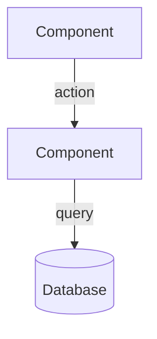

# Design: Usage Metering

## Overview
[How this integrates with the existing system. Key decisions and rationale.]

## Architecture


## Data Models
```typescript
interface Entity {
  id: string;
  // fields with comments explaining purpose
}
```

## API Contracts
### POST /api/resource
- **Request:** `{ field: type }`
- **Response (200):** `{ field: type }`
- **Errors:** 400 (validation), 401 (auth), 404 (not found)

## Security Considerations
[Auth, validation, data exposure risks]

## Error Handling
[Strategy per failure mode from requirements]

## Testing Strategy
- Unit / Integration / E2E: [what each covers]

## Constitution Check
Verify this design against each principle in `steering/constitution.md`. GATE: must pass before
implementation; re-check after any design change.
- [ ] [Principle 1] — complies
- [ ] [Principle 2] — complies
(If a principle cannot be met, do NOT silently break it — record it in Complexity Tracking below.)

## Complexity Tracking
Justify anything that violates a constitution principle or adds non-obvious complexity. Empty is good.
| What | Why it's needed | Simpler alternative rejected because |
|---|---|---|
| [e.g., second cache layer] | [reason] | [why the simple option fails] |

## [SaaS] Performance Budget
> **TODO** — replace with real values (remove this line when done).
- P50/P95/P99 latency targets · max DB query time · max memory/request · throughput target.

## [SaaS] Scale Design
> **TODO** — replace with real values (remove this line when done).
- Concurrent users (launch/6mo/2yr) · data growth · hot paths · caching (TTL+invalidation) · queue strategy · indexes · sharding.

## [SaaS] Multi-tenancy Model
> **TODO** — replace with real values (remove this line when done).
- Isolation (pooled/siloed/bridged) · how tenant_id is enforced · noisy-neighbor limits · export/delete (GDPR).

## [SaaS] Observability
> **TODO** — replace with real values (remove this line when done).
- Metrics (name each) · structured logs (events+fields) · traces (spans) · alerts (metric→threshold→who) · dashboard panels.

## [SaaS] Cost Envelope
> **TODO** — replace with real values (remove this line when done).
- $/1000 users/month (compute/storage/network/3p) · cost-critical paths · cost metric + alert threshold.

<!-- Tracks active: core +saas. Mandatory track sections above must have real
     content — an honest "not needed because X" is fine; blank is not. -->
