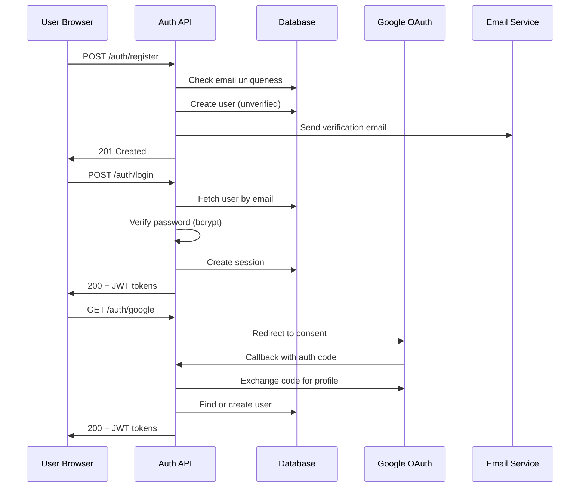

# Example: User Authentication Feature

This is a complete example showing all four spec artifacts for a user authentication feature.

---

## requirements.md

```markdown
# Feature: User Authentication

## Summary
Implement secure user authentication with email/password and Google OAuth, allowing users to
sign up, log in, and manage their sessions safely.

## User Stories

### US-1: Email/Password Registration
**As a** new user, **I want** to register with my email and password, **so that** I can create
an account and access the application.

#### Acceptance Criteria
1. WHEN a user submits the registration form with valid email and password THE SYSTEM SHALL
   create a new user account and send a verification email.
2. WHEN a user submits a registration form with an email that already exists THE SYSTEM SHALL
   display "An account with this email already exists" and offer a login link.
3. IF the password does not meet complexity requirements (minimum 8 characters, one uppercase,
   one number) THEN THE SYSTEM SHALL display specific validation errors next to the password
   field.
4. WHEN a user clicks the verification link in their email THE SYSTEM SHALL mark the account
   as verified and redirect to the login page.

### US-2: Login
**As a** registered user, **I want** to log in with my credentials, **so that** I can access
my data securely.

#### Acceptance Criteria
1. WHEN a user submits valid credentials THE SYSTEM SHALL authenticate the user, create a
   session, and redirect to the dashboard.
2. IF the user enters incorrect credentials THEN THE SYSTEM SHALL display "Invalid email or
   password" without revealing which field is wrong.
3. IF the user enters incorrect credentials 5 consecutive times THEN THE SYSTEM SHALL lock
   the account for 15 minutes and send a security alert email.
4. WHILE the user is authenticated, WHEN they close the browser and return within 7 days,
   THE SYSTEM SHALL restore their session without requiring re-authentication.

### US-3: Google OAuth Login
**As a** user, **I want** to log in with my Google account, **so that** I can access the
application without creating a separate password.

#### Acceptance Criteria
1. WHEN a user clicks "Sign in with Google" THE SYSTEM SHALL redirect to Google's OAuth
   consent screen.
2. WHEN Google authentication succeeds THE SYSTEM SHALL create or link the user account and
   redirect to the dashboard.
3. IF Google authentication fails or is cancelled THEN THE SYSTEM SHALL display an error
   message and return to the login page.

### US-4: Logout
**As a** logged-in user, **I want** to log out, **so that** I can end my session securely.

#### Acceptance Criteria
1. WHEN a user clicks "Log out" THE SYSTEM SHALL invalidate the session token, clear all
   client-side auth data, and redirect to the login page.
2. While the session is invalidated, WHEN the user navigates to a protected route THE SYSTEM
   SHALL redirect to the login page.

## Edge Cases & Error Handling
- Expired verification links: display "This link has expired" with option to resend
- Concurrent sessions: allow up to 3 active sessions per account
- OAuth provider downtime: display "Google sign-in is temporarily unavailable, please use
  email/password"

## Out of Scope
- Two-factor authentication (planned for Phase 2)
- Password reset flow (separate feature spec)
- Social login providers other than Google
```

---

## design.md

```markdown
# Design: User Authentication

## Overview
Authentication is implemented as a middleware layer using JWT tokens for session management.
The system supports both email/password and Google OAuth flows, with bcrypt for password
hashing and refresh tokens for session persistence.

## Architecture



## Data Models

```typescript
interface User {
  id: string;                    // UUID v4
  email: string;                 // Unique, lowercase
  passwordHash: string | null;   // Null for OAuth-only users
  name: string;
  emailVerified: boolean;
  googleId: string | null;       // For OAuth linking
  loginAttempts: number;         // Reset on successful login
  lockedUntil: Date | null;      // Account lock expiry
  createdAt: Date;
  updatedAt: Date;
}

interface Session {
  id: string;                    // UUID v4
  userId: string;                // FK to User
  refreshToken: string;          // Hashed
  expiresAt: Date;               // 7 days from creation
  createdAt: Date;
}
```

## API Contracts

### POST /auth/register
- **Request:** `{ email: string, password: string, name: string }`
- **Success (201):** `{ user: { id, email, name }, message: "Verification email sent" }`
- **Error (409):** `{ error: { code: "EMAIL_EXISTS", message: "..." } }`
- **Error (422):** `{ error: { code: "VALIDATION_ERROR", details: [...] } }`

### POST /auth/login
- **Request:** `{ email: string, password: string }`
- **Success (200):** `{ accessToken: string, refreshToken: string, user: { id, email, name } }`
- **Error (401):** `{ error: { code: "INVALID_CREDENTIALS" } }`
- **Error (423):** `{ error: { code: "ACCOUNT_LOCKED", lockedUntil: "ISO8601" } }`

### POST /auth/refresh
- **Request:** `{ refreshToken: string }`
- **Success (200):** `{ accessToken: string, refreshToken: string }`
- **Error (401):** `{ error: { code: "INVALID_TOKEN" } }`

### POST /auth/logout
- **Request:** _(empty, uses Authorization header)_
- **Success (200):** `{ message: "Logged out" }`

### GET /auth/google → redirect
### GET /auth/google/callback → redirect with tokens

## Security Considerations
- Passwords hashed with bcrypt (cost factor 12)
- JWT access tokens expire in 15 minutes
- Refresh tokens hashed in database, expire in 7 days
- Rate limiting: 10 requests/minute on auth endpoints
- CSRF protection via SameSite cookies
- Generic error messages to prevent user enumeration

## Error Handling
- Database connection failures: return 503 with retry-after header
- Email service failures: queue for retry, don't block registration
- OAuth provider failures: graceful fallback to email/password login
- Token validation failures: clear client tokens, redirect to login

## Testing Strategy
- **Unit:** Password validation, JWT generation/verification, rate limiting logic
- **Integration:** Full auth flow (register → verify → login → refresh → logout)
- **E2E:** Registration form, login form, Google OAuth redirect flow
```

---

## tasks.md

```markdown
# Implementation Tasks: User Authentication

## Phase 1: Database & Models

- [ ] 1. Create User and Session database models
  - Define Prisma schema for User and Session tables
  - Add indexes on email (unique) and googleId
  - Run initial migration
  - _Requirements: US-1 AC-1, US-2 AC-1_

- [ ] 2. Implement password hashing utilities
  - Create hashPassword and verifyPassword functions using bcrypt
  - Write unit tests for hash/verify round-trip
  - Write unit tests for password complexity validation
  - _Requirements: US-1 AC-3_

## Phase 2: Core Auth Endpoints

- [ ] 3. Implement POST /auth/register
  - Validate email format and password complexity
  - Check for existing email (return 409 if exists)
  - Create user with hashed password
  - Trigger verification email (stub for now)
  - Write integration tests
  - _Requirements: US-1 AC-1, US-1 AC-2, US-1 AC-3_

- [ ] 4. Implement POST /auth/login
  - Validate credentials against stored hash
  - Track login attempts, implement account locking after 5 failures
  - Generate JWT access + refresh tokens on success
  - Create session record in database
  - Write integration tests including lockout scenario
  - _Requirements: US-2 AC-1, US-2 AC-2, US-2 AC-3_

- [ ] 5. Implement POST /auth/refresh and POST /auth/logout
  - Validate refresh token, issue new token pair
  - Invalidate session on logout, clear client tokens
  - Write integration tests for token refresh and logout
  - _Requirements: US-2 AC-4, US-4 AC-1, US-4 AC-2_

## Phase 3: Email Verification

- [ ] 6. Implement email verification flow
  - Generate secure verification tokens (UUID + expiry)
  - Create GET /auth/verify/:token endpoint
  - Send verification email using email service
  - Handle expired tokens with re-send option
  - Write integration tests
  - _Requirements: US-1 AC-1, US-1 AC-4_

## Phase 4: Google OAuth

- [ ] 7. Implement Google OAuth flow
  - Configure Google OAuth client
  - Create GET /auth/google redirect endpoint
  - Create GET /auth/google/callback handler
  - Find-or-create user from Google profile
  - Link Google account to existing email if match
  - Write integration tests (mock Google responses)
  - _Requirements: US-3 AC-1, US-3 AC-2, US-3 AC-3_

## Phase 5: Middleware & Protection

- [ ] 8. Implement auth middleware
  - Create requireAuth middleware that validates JWT from Authorization header
  - Handle expired tokens (return 401 with refresh hint)
  - Add rate limiting to auth endpoints (10 req/min)
  - Apply middleware to protected routes
  - Write unit tests for middleware
  - _Requirements: US-2 AC-1, US-4 AC-2_

## Phase 6: E2E Testing

- [ ] 9. Write E2E tests for complete auth flows
  - Registration → verification → login → dashboard access
  - Google OAuth flow (with mocked provider)
  - Account lockout and recovery
  - Session persistence across browser close
  - _Requirements: US-1 AC-1 through AC-4, US-2 AC-1 through AC-4, US-3 AC-1 through AC-3_
```

This example demonstrates the full traceability chain: every task links back to specific
acceptance criteria, which are part of user stories, which address the original feature need.
