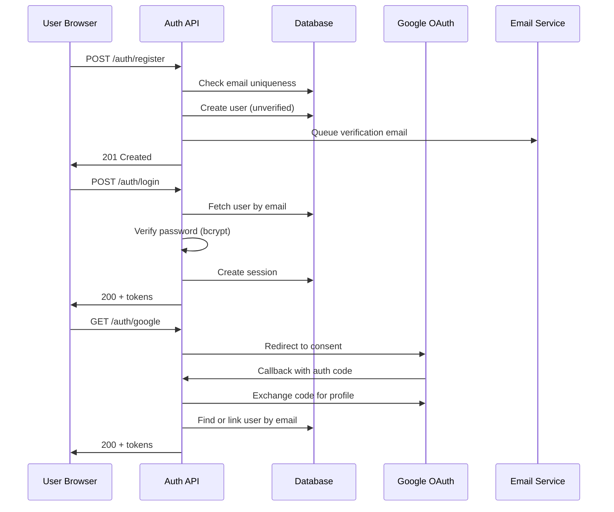

# Example: User Authentication Feature (`core +tdd`)

A complete example of the spec artifacts for a user authentication feature: `requirements.md`, `design.md`,
`test-plan.md` and `tasks.md`. It shows the conventions the engine checks — stable IDs (`US-1.AC-1`, `SC-001`,
`EC-1`, `NFR-1`, `T-01`), prioritized stories, the test plan's **Kind** column, story-organized tasks with
`[US1]`/`[shared]`/`[P]` tags and `**Checkpoint:**` lines, and every traceability marker (`_Requirements:_`,
`_Makes green:_`, `_Implements:_`, `_Verify:_`).

---

## requirements.md

```markdown
# Feature: User Authentication

## Summary
Email/password and Google sign-in with persistent sessions, so users can create an account, log in and
log out without exposing their credentials.

## User Stories
Priorities: P1 = MVP (ships on its own) · P2 = next.

### US-1 (P1 — MVP): Email/password registration
**As a** new user, **I want** to register with my email and password, **so that** I can create an account.
**Independent Test:** register a new email, open the verification link, see the login page.

#### Acceptance Criteria
1. **US-1.AC-1** — WHEN a user submits the registration form with a well-formed email and a compliant password
   THE SYSTEM SHALL create an unverified account and send one verification email.
2. **US-1.AC-2** — WHEN a user submits the registration form with an email that already exists THE SYSTEM SHALL
   display "An account with this email already exists" and offer a login link.
3. **US-1.AC-3** — IF the password has fewer than 8 characters, no uppercase letter or no digit THEN THE SYSTEM
   SHALL reject it and show one validation error per failed rule next to the password field.
4. **US-1.AC-4** — WHEN a user opens a verification link less than 24 hours old THE SYSTEM SHALL mark the account
   as verified and redirect to the login page.

### US-2 (P1 — MVP): Login and session
**As a** registered user, **I want** to log in and stay logged in, **so that** I can reach my data.
**Independent Test:** log in with a verified account, close the browser, come back, still logged in.

#### Acceptance Criteria
1. **US-2.AC-1** — WHEN a verified user submits correct credentials THE SYSTEM SHALL create a session and
   redirect to the dashboard.
2. **US-2.AC-2** — IF the credentials are incorrect THEN THE SYSTEM SHALL display "Invalid email or password"
   without revealing which field is wrong.
3. **US-2.AC-3** — IF a user enters incorrect credentials 5 consecutive times THEN THE SYSTEM SHALL lock the
   account for 15 minutes and send one security alert email.
4. **US-2.AC-4** — WHILE a session is less than 7 days old, WHEN the user returns after closing the browser,
   THE SYSTEM SHALL restore the session without asking for credentials.
5. **US-2.AC-5** — THE SYSTEM SHALL store passwords only as bcrypt hashes with cost factor 12, never as the
   submitted text.

### US-3 (P2): Google sign-in
**As a** user, **I want** to sign in with Google, **so that** I don't manage another password.
**Independent Test:** sign in through a mocked Google provider and land on the dashboard.

#### Acceptance Criteria
1. **US-3.AC-1** — WHEN a user clicks "Sign in with Google" THE SYSTEM SHALL redirect to Google's OAuth consent
   screen.
2. **US-3.AC-2** — WHEN Google authentication succeeds THE SYSTEM SHALL create or link the account by email and
   redirect to the dashboard.
3. **US-3.AC-3** — IF Google authentication fails or is cancelled THEN THE SYSTEM SHALL display "Google sign-in
   failed" and return to the login page.

### US-4 (P2): Logout
**As a** logged-in user, **I want** to log out, **so that** nobody else can use my session.
**Independent Test:** log out, then call a protected route with the old token and get 401.

#### Acceptance Criteria
1. **US-4.AC-1** — WHEN a user clicks "Log out" THE SYSTEM SHALL invalidate the session and redirect to the
   login page.
2. **US-4.AC-2** — WHILE a session is invalidated, WHEN its token is used on a protected route, THE SYSTEM SHALL
   respond 401 and redirect to the login page.

## Success Criteria
- **SC-001** — 90% of new users complete registration and their first login in under 2 minutes.
- **SC-002** — Login-related support tickets drop by 50% within a month of launch.

## Edge Cases & Error Handling
- **EC-1** — An expired verification link shows "This link has expired" with a button to resend it.
- **EC-2** — A 4th concurrent session closes the account's oldest session (at most 3 at a time).
- **EC-3** — While Google is unreachable, the login page shows "Google sign-in is temporarily unavailable — use
  email and password".

## Non-Functional Requirements
- **NFR-1** — Auth endpoints answer within 300 ms at P95 under 50 requests per second.
- **NFR-2** — Auth endpoints accept at most 10 requests per minute per IP address.

## Out of Scope
- Two-factor authentication (planned for Phase 2)
- Password reset (separate feature spec)
- Social providers other than Google
```

SC-001 and SC-002 are outcomes, checked by the quickstart walk-through and after launch — not by unit tests.

---

## design.md

````markdown
# Design: User Authentication

## Overview
Authentication is a middleware layer using short-lived JWT access tokens plus hashed refresh tokens for
session persistence. Email/password and Google OAuth share one session model; bcrypt hashes passwords.

## Architecture



## Data Models

```typescript
interface User {
  id: string;                    // UUID v4
  email: string;                 // unique, lowercase
  passwordHash: string | null;   // null for Google-only users (US-2.AC-5: bcrypt, cost 12)
  emailVerified: boolean;
  googleId: string | null;
  failedLogins: number;          // reset on successful login (US-2.AC-3)
  lockedUntil: Date | null;
  createdAt: Date;
}

interface Session {
  id: string;
  userId: string;
  refreshTokenHash: string;
  expiresAt: Date;               // 7 days (US-2.AC-4)
  createdAt: Date;
}
```

## API Contracts
- `POST /auth/register` → 201 `{ user }` · 409 `EMAIL_EXISTS` (US-1.AC-2) · 422 `VALIDATION_ERROR` with one detail per failed rule (US-1.AC-3)
- `GET /auth/verify/:token` → 302 to /login · 410 `LINK_EXPIRED` + resend option (EC-1)
- `POST /auth/login` → 200 `{ accessToken, refreshToken }` · 401 `INVALID_CREDENTIALS` (same body for any wrong field, US-2.AC-2) · 423 `ACCOUNT_LOCKED`
- `POST /auth/refresh` → 200 new token pair · 401 `INVALID_TOKEN`
- `POST /auth/logout` → 200 (US-4.AC-1)
- `GET /auth/google`, `GET /auth/google/callback` → redirects (US-3)

## Security
- bcrypt cost 12; access tokens 15 min; refresh tokens hashed, 7 days; SameSite cookies against CSRF.
- Rate limit 10 req/min per IP on `/auth/*` (NFR-2); generic errors against user enumeration.

## Error Handling
- Database down → 503 with `Retry-After`. Email service down → queue and retry, never block registration.
- Google unreachable → the "temporarily unavailable" message (EC-3); email/password keeps working.

## Testing Strategy
Unit tests for password rules and hashing (property-based), integration tests per endpoint against a real test
database, one E2E journey (register → verify → login → logout). See test-plan.md.

## Testability Notes
- Clock injected (token expiry, lockout window, link age); email and Google clients behind interfaces with fakes.
- Test database reset per file; seed factory for users in each state (unverified, verified, locked, Google-only).

## Constitution Check
- "Secrets never logged" — tokens and passwords are redacted by the logger's serializer. ✅
- "Every write is idempotent" — registration keys on the email; a retried request returns 409, never a duplicate. ✅
- "Errors fail closed" — token validation errors end the session. ✅

## Complexity Tracking
| Deviation | Why needed | Simpler alternative rejected because |
|---|---|---|
| (none) | — | — |
````

---

## test-plan.md

```markdown
# Test Plan: User Authentication

## Strategy
- **Test runner:** Vitest; Supertest for HTTP; fast-check for property-based tests.
- **Mocking approach:** real test database; email and Google behind fakes; injected clock.
- **Coverage target:** 90% lines; 100% branches in password, login and session code.

## Traceability Matrix

| Test ID | Layer | Kind | Description | Covers (AC IDs) | File |
|---------|-------|------|-------------|-----------------|------|
| T-01 | integration | example | a valid registration creates an unverified user and queues one verification email | US-1.AC-1 | `tests/integration/register.test.ts` |
| T-02 | integration | example | a duplicate email returns 409 with the "already exists" message and a login link | US-1.AC-2 | `tests/integration/register.test.ts` |
| T-03 | unit | property | any generated password breaking rules gets exactly one error per broken rule; any compliant one passes | US-1.AC-3 | `src/lib/password.test.ts` |
| T-04 | integration | example | a fresh link verifies the account; a 25-hour-old link shows "expired" with a resend button | US-1.AC-4, EC-1 | `tests/integration/verify.test.ts` |
| T-05 | integration | example | correct credentials create a session and redirect to the dashboard | US-2.AC-1 | `tests/integration/login.test.ts` |
| T-06 | integration | property | for any wrong email/password combination the 401 body is identical | US-2.AC-2 | `tests/integration/login.test.ts` |
| T-07 | integration | example | 5 failures lock the account for 15 minutes and send one alert; attempt 6 gets 423 | US-2.AC-3 | `tests/integration/lockout.test.ts` |
| T-08 | integration | example | a 6-day-old refresh token restores the session; an 8-day-old one does not | US-2.AC-4 | `tests/integration/session.test.ts` |
| T-09 | unit | property | for any generated password the stored value is a cost-12 bcrypt hash that verifies and never equals the input | US-2.AC-5 | `src/lib/password.test.ts` |
| T-10 | integration | example | Google redirect, successful callback (create + link by email) and failed callback (mocked provider) | US-3.AC-1, US-3.AC-2, US-3.AC-3 | `tests/integration/google.test.ts` |
| T-11 | integration | example | logout invalidates the session; the old token then gets 401 on a protected route | US-4.AC-1, US-4.AC-2 | `tests/integration/logout.test.ts` |
| T-12 | integration | example | a 4th concurrent session closes the oldest one | EC-2 | `tests/integration/session.test.ts` |
| T-13 | integration | example | the 11th request in a minute from one IP gets 429 | NFR-2 | `tests/integration/rate-limit.test.ts` |

## Coverage Check
Every AC appears in at least one "Covers" cell. EC-3 and NFR-1 are covered by tasks 9 and 8; SC-001 by the
quickstart.md walk-through. No gaps.

## Test Data & Fixtures
- User factory (unverified / verified / locked / Google-only); fake clock; fake mailer that records messages.

## Out of Scope for Testing
- Google's own consent screen (mocked at the HTTP boundary).
```

Each test carries its T-ID in its name — `it("T-03 one error per broken password rule", …)` — so
`trace_check {code: true}` (`dev-spec trace auth --code`) finds every planned test in the code.

---

## tasks.md

```markdown
# Implementation Tasks: User Authentication

## Global Constraints
- bcrypt cost 12 · access token 15 min · refresh token 7 days · lockout 5 failures / 15 min · 10 req/min per IP

## Phase: Setup
- [ ] 1. [shared] User and Session models + migration (unique email, googleId index)
  - _Requirements: US-1.AC-1, US-2.AC-1_
  - _Implements: prisma/schema.prisma_
  - _Verify: npx prisma validate_

## Phase: Foundational
- [ ] 2. [shared][P] Password utilities: bcrypt hash/verify (cost 12) + complexity rules
  - _Requirements: US-1.AC-3, US-2.AC-5_
  - _Makes green: T-03, T-09_
  - _Implements: src/lib/password.ts_
  - _Verify: npx vitest run src/lib/password.test.ts_
- [ ] 3. [shared][P] Rate limiting on /auth/* (10 req/min per IP)
  - _Requirements: NFR-2_
  - _Makes green: T-13_
  - _Implements: src/middleware/rate-limit.ts_
  - _Verify: npx vitest run tests/integration/rate-limit.test.ts_

**Checkpoint:** password and rate-limit tests green; every story can start.

## Phase: Story US-1 (P1)
- [ ] 4. [US1] POST /auth/register — validation, 409 on duplicate, unverified user, verification email queued
  - _Requirements: US-1.AC-1, US-1.AC-2, US-1.AC-3_
  - _Makes green: T-01, T-02_
  - _Implements: src/auth/register.ts_
  - _Verify: npx vitest run tests/integration/register.test.ts_
- [ ] 5. [US1] GET /auth/verify/:token — 24 h expiry, resend on an expired link
  - _Requirements: US-1.AC-4, EC-1_
  - _Makes green: T-04_
  - _Implements: src/auth/verify.ts_
  - _Verify: npx vitest run tests/integration/verify.test.ts_

**Checkpoint:** US-1 independently testable — register and verify.

## Phase: Story US-2 (P1)
- [ ] 6. [US2] POST /auth/login with lockout and security alert
  - _Requirements: US-2.AC-1, US-2.AC-2, US-2.AC-3_
  - _Makes green: T-05, T-06, T-07_
  - _Implements: src/auth/login.ts_
  - _Verify: npx vitest run tests/integration/login.test.ts tests/integration/lockout.test.ts_
- [ ] 7. [US2] Sessions — refresh (7 days), at most 3 concurrent, requireAuth middleware
  - _Requirements: US-2.AC-4, EC-2_
  - _Makes green: T-08, T-12_
  - _Implements: src/auth/session.ts, src/middleware/require-auth.ts_
  - _Verify: npx vitest run tests/integration/session.test.ts_
- [ ] 8. [US2] Latency check — auth endpoints P95 ≤ 300 ms at 50 req/s
  - _Requirements: NFR-1_
  - _Verify: k6 run load/auth.js_

**Checkpoint:** the MVP (US-1 + US-2) — register, verify, log in and stay logged in.

## Phase: Story US-3 (P2)
- [ ] 9. [US3] Google OAuth — redirect, callback, find-or-link by email, failure path, provider-down message
  - _Requirements: US-3.AC-1, US-3.AC-2, US-3.AC-3, EC-3_
  - _Makes green: T-10_
  - _Implements: src/auth/google.ts_
  - _Verify: npx vitest run tests/integration/google.test.ts_

**Checkpoint:** Google sign-in works against the mocked provider.

## Phase: Story US-4 (P2)
- [ ] 10. [US4] POST /auth/logout — invalidate the session, clear client tokens
  - _Requirements: US-4.AC-1, US-4.AC-2_
  - _Makes green: T-11_
  - _Implements: src/auth/logout.ts_
  - _Verify: npx vitest run tests/integration/logout.test.ts_

**Checkpoint:** logout ends the session everywhere.

## Phase: Polish
- [ ] 11. [shared] Full suite green + quickstart.md walk-through (time the SC-001 journey)
  - _Requirements: US-1.AC-1, US-2.AC-1_
  - _Verify: npx vitest run_
```

This example demonstrates the full traceability chain: every AC is covered by a test and a task, every planned
T-ID is made green by a task, edge cases and NFRs trace too, and every task names the command that proves it.
Each task is ticked only with `spec_complete_task {evidence: {command, exitCode: 0, …}}` — for task 4:
`{command: "npx vitest run tests/integration/register.test.ts", exitCode: 0, summary: "2 passed"}`.
