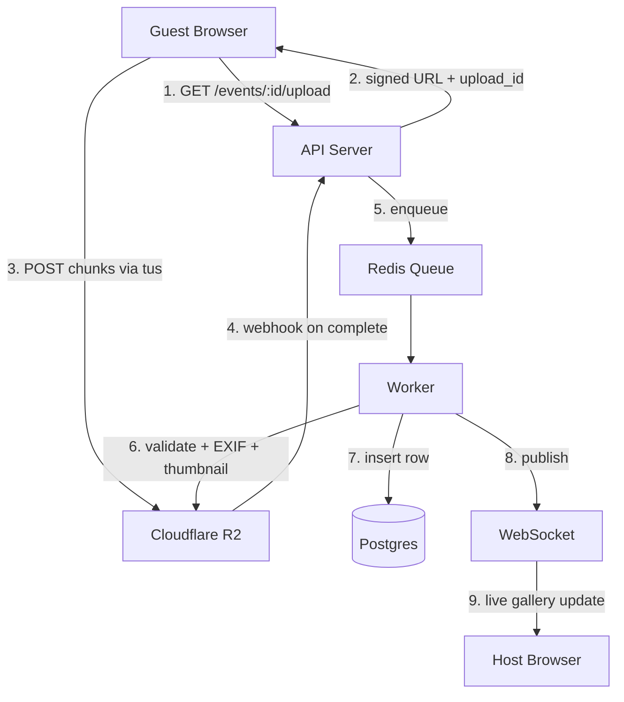

# Scale Design Template: Full Worked Example

This document shows what a complete `design.md` looks like for a SaaS feature, with every
scale section filled in properly. Use this as the reference when writing your own design
docs — copy the structure, adapt the content.

The example feature is **guest photo upload** from a Memogram-style event platform: guests
scan a QR code, land on an upload page, and submit photos/videos that go into the host's
gallery. It's the hot path for the whole product.

---

# Design: Guest Photo Upload

## Overview

Guests upload photos and videos from their mobile browser to an event gallery. Uploads must
survive venue WiFi dropouts, handle 10MB+ photos and 500MB+ videos, preserve EXIF rotation,
and scale to 200 concurrent guests per event across thousands of concurrent events on peak
Saturdays.

Key decisions:
- **Chunked upload via `tus.io` protocol** — handles resume, partial upload, slow networks
- **Direct-to-storage** (Cloudflare R2 signed URLs) — bypasses our API server for bytes,
  which we couldn't afford to proxy at scale
- **Client-side compression** for photos >2MB before upload — saves network bandwidth 60%
- **Server-side validation + async processing** — size, type, EXIF normalization,
  thumbnail generation happen in a worker after the upload completes
- **Rate-limited per event** — an event has a quota; a single guest can't DoS it

## Architecture



## Data Models

```typescript
// media table
interface Media {
  id: string;              // ULID, sortable by time
  event_id: string;        // tenant_id — always present, always indexed, always in WHERE
  guest_id: string | null; // null for anonymous uploads
  upload_id: string;       // tus upload ID for idempotency
  storage_key: string;     // R2 object key
  kind: 'photo' | 'video';
  bytes: number;
  width: number | null;    // from EXIF after processing
  height: number | null;
  duration_ms: number | null; // videos only
  status: 'uploading' | 'processing' | 'ready' | 'failed';
  created_at: Date;
  ready_at: Date | null;
}

// Indexes:
// - (event_id, created_at DESC) — gallery query, hottest index
// - (event_id, status)          — worker polling
// - (upload_id) UNIQUE          — idempotency
```

## API Contracts

### POST /api/events/:id/uploads/initiate
Initiates a chunked upload. Returns a tus.io upload URL signed for direct R2 upload.
- **Request:** `{ filename: string, bytes: number, mime_type: string }`
- **Response (200):** `{ upload_id: string, upload_url: string, expires_at: string }`
- **Errors:**
  - 400 — validation (bytes > 500MB, mime_type not in allowlist)
  - 401 — invalid event access (password-protected event)
  - 429 — per-event rate limit exceeded
  - 507 — event storage quota exhausted

### POST /webhooks/r2/upload-complete
Called by R2 when an upload finalizes. Signature verified.
- **Request:** `{ upload_id: string, storage_key: string, bytes: number }`
- **Response:** `200 OK` — enqueued for processing
- **Idempotency:** If called twice with same upload_id, second call is a no-op.

## Security Considerations

- **Signed URLs** expire in 15 minutes and are single-use (tus upload_id binding).
- **File type validation** happens twice: mime_type allowlist at initiate, magic-byte
  check in worker (mime_type is user-controlled; extension is user-controlled).
- **Event access** verified at initiate time (password, not expired, within capacity).
- **No direct DB writes from untrusted input** — worker validates everything from R2 again.
- **EXIF scrubbing optional** — event host can opt into scrubbing GPS/device info from
  guest uploads (GDPR-friendly default for corporate events).

## Error Handling

- R2 upload failure → tus client auto-resumes. If 3 full retries fail, surface error to
  guest with retry button.
- Worker processing failure → retry with exponential backoff (3 attempts). After 3
  failures, mark status=failed and emit alert. Host can see "3 uploads failed to process"
  in the dashboard.
- Webhook signature mismatch → reject, alert (potential attack).
- Duplicate webhook → idempotent no-op.
- Event quota hit mid-upload → upload completes, but insert fails gracefully with clear
  error to host.

---

## Performance Budget

| Metric | Target | Rationale |
|---|---|---|
| P50 page load (upload page) | < 400ms | Guests on 4G, impatient, mid-event |
| P95 page load | < 1200ms | Still acceptable on bad WiFi |
| P99 page load | < 2500ms | Tolerated but logged |
| P95 chunk upload round-trip | < 800ms per 5MB chunk | Network-bound, mostly R2's problem |
| Worker processing latency P95 | < 8s from upload-complete to ready | Host wants to see it quickly |
| Gallery query P95 | < 150ms for 100 items | Host refresh during event |
| DB query max time | < 50ms per query | Anything slower is a missing index |
| Memory per request | < 80MB | Fits comfortably in container limit |
| Throughput (API server) | 500 req/s sustained, 2000 req/s burst | Covers 10k concurrent guests |
| Worker throughput | 200 uploads/min per worker | Scales horizontally |

**If any metric regresses by >20% in load test or production, that's a rollback trigger.**

---

## Scale Design

### Expected load
- **Launch (month 1):** 500 events/month, avg 30 guests each, 15 uploads/guest = 225K
  uploads/month (~7K/day, ~5/min avg, ~50/min peak)
- **6 months:** 5K events/month = 2.25M uploads/month (~75K/day, ~50/min avg)
- **2 years:** 50K events/month = 22.5M uploads/month, peak Saturdays 500-1000 concurrent
  events. Single event max assumed: 500 guests × 30 uploads = 15K uploads over 4 hours.

### Data growth
- **Metadata per upload:** ~500 bytes in Postgres (row + indexes)
- **Media per upload:** avg 3MB photo, avg 40MB video, ~5MB weighted
- **1M uploads:** 500MB metadata, 5TB media
- **Retention:** 90 days free tier → lifecycle transition to cold storage or delete

### Hot paths
1. Guest upload initiate (`POST /uploads/initiate`) — heaviest API load
2. Gallery list (`GET /events/:id/gallery`) — host refreshes during event
3. Worker processing — CPU-bound on thumbnails + EXIF

### Caching strategy
| What | Where | TTL | Invalidation |
|---|---|---|---|
| Event metadata (name, settings, password hash) | Redis | 5 min | On event edit |
| Gallery list (first page, last 50) | Redis | 10 sec | On new upload webhook |
| Signed upload URLs | No cache (single-use) | 15 min expiry | — |
| Guest rate limit counter | Redis | 60 sec sliding | — |
| Thumbnail URLs | CDN (CloudFront) | 1 year | Versioned URLs, never invalidate |

Cache hit rate target: >90% on event metadata, >70% on gallery.

### Queue strategy
- **Queue:** BullMQ on Redis
- **Concurrency:** 10 workers, 5 jobs each = 50 concurrent uploads processing
- **Retry:** 3 attempts, exponential backoff (2s, 10s, 60s)
- **DLQ:** After 3 failures, move to failed queue. Alert if DLQ size > 20.
- **Priority:** Upload processing is FIFO per event, to keep gallery order intuitive

### Database indexes
Explicit index plan (with selectivity estimates):
- `media(event_id, created_at DESC)` — primary gallery query, high selectivity
- `media(event_id, status)` — worker/host filtering, medium selectivity
- `media(upload_id) UNIQUE` — webhook idempotency, unique
- `events(tenant_id, slug)` — tenant lookup, unique per tenant
- **No full-table scans allowed.** EXPLAIN ANALYZE every query in review.

### Sharding / partitioning
- Not at launch. Reassess when `media` table > 100M rows.
- When sharded: partition by `event_id` hash, so an event's media stays on one shard.
  Analytics queries across all events go through a read replica or ClickHouse.

---

## Multi-tenancy Model

### Isolation model
**Pooled** — shared Postgres, shared Redis, shared R2 bucket, with `event_id` as tenant
discriminator. Every media row has an `event_id`. Every query must filter on `event_id`.

### Row-level security
Enforced at two layers:
1. **App layer:** ORM model has a `scoped(event_id)` middleware that refuses to query
   without an `event_id` in the WHERE clause. Raises in dev, logs+alerts in prod.
2. **Postgres RLS:** enabled on `media` table as defense-in-depth. The app sets
   `SET LOCAL app.current_event_id` per request; the RLS policy filters rows.

### Noisy neighbor protection
- **Per-event rate limit:** 200 upload-initiate/min. Token bucket in Redis.
- **Per-event upload concurrency:** max 50 concurrent uploads in-progress per event. Newer
  attempts get 429 with Retry-After.
- **Per-event storage quota:** enforced at initiate time. Free tier = 5GB, Paid = 50GB+.
- **Per-IP rate limit:** 30 upload-initiate/min from one IP. Prevents one guest from
  overwhelming an event.

### Data export / deletion
- **Event deletion** cascades to media rows and schedules R2 object deletion via lifecycle.
- **Guest GDPR erasure** (if guest is identifiable): delete their rows, delete their R2
  objects, confirm within 30 days.
- **Event bulk export** — zip file of all media + JSON metadata, generated by worker,
  signed URL valid 24h.

---

## Observability

### Metrics (emitted to Prometheus)
- `upload_initiate_total{event_id, status}` — counter of initiate attempts
- `upload_initiate_duration_seconds{}` — histogram
- `upload_complete_total{status}` — counter from webhook
- `upload_processing_duration_seconds{kind}` — histogram for workers
- `upload_bytes_total{kind}` — counter for throughput
- `gallery_query_duration_seconds{}` — histogram
- `event_storage_bytes{event_id}` — gauge
- `rate_limit_hit_total{scope}` — counter for 429s
- `worker_queue_depth{queue}` — gauge
- `worker_dlq_depth{queue}` — gauge

### Logs (structured JSON)
At these events, emit a log line with the listed fields:
- `upload.initiated` — event_id, guest_id, upload_id, bytes, mime_type, client_ip
- `upload.completed` — upload_id, bytes_uploaded, duration_ms
- `upload.failed` — upload_id, reason, retry_count
- `upload.processed` — upload_id, processing_duration_ms, width, height
- `rate_limit.hit` — scope (event / ip), key, current_count, limit

### Traces
OpenTelemetry trace per request. Spans:
- `http.request` → `db.query(event_lookup)` → `redis.get(rate_limit)` →
  `storage.sign_url` → `http.response`

For worker jobs: one trace per job, spans for download-from-R2, validate, exif-parse,
thumbnail, upload-back-to-R2, db-insert, websocket-publish.

### Alerts (PagerDuty)
- P95 gallery query > 300ms for 5 min → warn
- P95 gallery query > 1000ms for 2 min → page
- Worker DLQ depth > 20 → page
- Upload initiate 5xx rate > 1% for 5 min → page
- Event storage >80% of quota → email host (not paged)

### Dashboards (Grafana)
- **Upload Pipeline dashboard:** initiate rate, completion rate, processing latency, DLQ
  depth, 429 rate, 5xx rate
- **Per-event view** (lookup by event_id): uploads over time, storage used, errors

---

## Cost Envelope

### Per-1000-users-per-month (conservative)

| Line item | Estimate | Unit cost | Total |
|---|---|---|---|
| R2 storage (avg 300MB/user) | 300GB | $0.015/GB/mo | $4.50 |
| R2 egress (0 — free) | — | — | $0 |
| R2 Class A ops (1M writes) | 1M | $4.50/M | $4.50 |
| Postgres (managed, shared) | — | allocated | $1.50 |
| Redis (managed, shared) | — | allocated | $0.50 |
| Compute (API + workers) | — | allocated | $3.00 |
| CDN (CloudFront, 1TB egress) | 1000GB | $0.085/GB | $85.00 |

**Rough total: ~$99/1000 users/month**, heavily dominated by CDN egress when hosts share
galleries widely. Without wide sharing, closer to $15/1000/mo.

### Cost-critical paths
- **CDN egress** is the dominant line item. Optimizations:
  - Serve thumbnails via CDN, full-res only on explicit request
  - Private gallery = no CDN, use signed URLs direct from R2 (no egress fees on R2)
- **R2 Class A ops** (writes) — 1 op per upload + 1 per thumbnail = 2M ops per 1M uploads.
  Watch this at scale.

### Cost monitoring
- Weekly dashboard of cost per tenant tier (free / paid / enterprise)
- Alert if any single event generates > $5 in CDN egress in one day (likely viral share
  or abuse)

---

## Testing Strategy

- **Unit:** Input validation (mime type, size, magic bytes), EXIF rotation normalization,
  rate limit token bucket math, quota arithmetic
- **Integration:** Full upload flow in staging (initiate → R2 mock → webhook → worker →
  DB → websocket), cross-tenant probes (event A cannot read event B), idempotent webhook,
  concurrent uploads to same event
- **E2E (Playwright):** Happy path on real browser, slow-network simulation, resume after
  disconnect
- **Load (k6):** See `load-test.md`. 200 concurrent guests, each uploading 20 photos of
  random sizes 500KB–20MB over 60 seconds.
- **Chaos:** Kill a worker mid-job, verify resumability. Inject R2 500s, verify retry.
